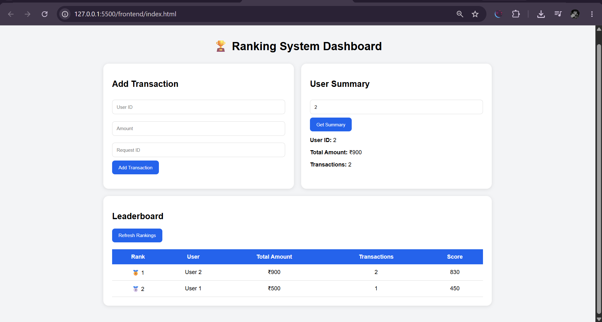

# Ranking System

A Flask-based backend service with a simple frontend demonstrating transaction processing, duplicate request prevention, user summaries, and fair ranking logic.

---
## Application Preview



## Features

* Transaction Processing
* Duplicate Request Prevention
* User Summary API
* Fair Ranking Algorithm
* Transaction History
* Input Validation
* SQLite Database
* Frontend Dashboard
* Leaderboard UI

---

# Tech Stack

### Backend

* Python
* Flask
* SQLAlchemy
* SQLite
* Flask-CORS

### Frontend

* HTML
* CSS
* JavaScript

### Deployment

Backend : Render

Frontend : Netlify

---
## Live Demo

Frontend:
https://rankystem.netlify.app/


Backend:
https://ranking-system-ei2l.onrender.com/

# Project Structure

```text
ranking-system/

├── backend/
│   ├── app.py
│   ├── models.py
│   ├── routes.py
│   ├── ranking.db
│   └── utils.py
│
├── frontend/
│   ├── index.html
│   ├── style.css
│   └── app.js
│
├── requirements.txt
├── README.md
└── venv/
```

---

# Setup Instructions

### Clone Repository

```bash
git clone <repository_url>

cd ranking-system
```

---

### Create Virtual Environment

```bash
python -m venv venv
```

Windows

```bash
venv\Scripts\activate
```

Linux

```bash
source venv/bin/activate
```

---

### Install Dependencies

```bash
pip install -r requirements.txt
```

---

### Run Backend

```bash
cd backend

python app.py
```

Server runs at

```text
http://127.0.0.1:5000
```

---

### Run Frontend

Open

```text
frontend/index.html
```

or use VS Code Live Server.

---

# API Documentation

---

## POST /transaction

Creates a transaction.

### Request

```json
{
    "user_id":1,
    "amount":500,
    "request_id":"abc123"
}
```

---

### Success Response

```json
{
    "message":"Transaction Added"
}
```

Status

```text
201 Created
```

---

### Duplicate Request

```json
{
    "message":"Duplicate request"
}
```

Status

```text
409 Conflict
```

---

### Invalid Input

```json
{
    "error":"Amount must be positive"
}
```

Status

```text
400 Bad Request
```

---

## GET /summary/<user_id>

Returns user summary.

Example

```text
GET /summary/1
```

Response

```json
{
    "user_id":1,

    "total_amount":1200,

    "transactions":2,

    "history":[

        {

            "amount":500,

            "request_id":"abc123",

            "timestamp":"2026-06-22 23:15:10"

        }

    ]

}
```

---

## GET /ranking

Returns leaderboard.

Example

```text
GET /ranking
```

Response

```json
[

{

"user_id":1,

"name":"User 1",

"total_amount":1200,

"transactions":2,

"score":1040


}

]
```

---

# Ranking Logic

Ranking is based on more than one factor.

Formula

```python
score = (

total_amount * 0.7

+

transaction_count * 100

)
```

### Why?

The ranking system considers:

• Transaction Volume

• User Activity

This prevents users from dominating rankings solely through one large transaction while still rewarding consistent participation.

---

# Duplicate Prevention

Each transaction contains a unique request identifier.

Example

```python
request_id = "abc123"
```

Before creating a transaction, the system checks:

```python
duplicate = Transaction.query.filter_by(

request_id=request_id

).first()
```

If a duplicate request is found:

```json
{

"message":"Duplicate request"

}
```

Status Code

```text
409
```

---

# Assumptions

Users are automatically created when their first transaction is received.

SQLite is used as the database.

Ranking weights are configurable.

---

# Deployment

Backend

Render

Frontend

Netlify

---

# Future Improvements

Authentication

Pagination

Redis Caching

PostgreSQL

JWT

Docker

CI/CD

---

# Author

Nishant Kumar

B.Tech Computer Science

Delhi Technical Campus

Expected Graduation : 2027
